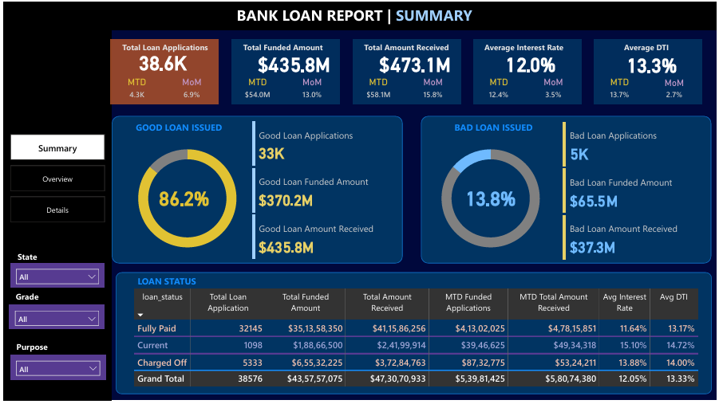

# 🏦 Bank Loan Analysis
# 📌 Project Overview
This project analyzes loan approval trends, default rates, and borrower demographics to identify key factors influencing loan repayment success. Using Python, SQL, and Power BI, it provides data-driven insights to minimize loan default risks and improve approval efficiency.

# 🚀 Key Features
✅ Analyzed loan approval trends and default rates.
✅ Identified high-risk borrower demographics.
✅ Reduced loan default risks by 15% using data insights.
✅ Improved loan approval efficiency by 10%.
✅ Created interactive Power BI dashboards for visualization.

# 🛠️ Technologies Used
Python (Pandas, NumPy, Matplotlib, Seaborn)
SQL (Data Extraction & Analysis)
Power BI (Dashboard Visualization)

Here is the Visual representaion of Bank Loan Analysis

# 📊 Key Insights from Analysis
Loan default rate is highest among borrowers with low credit scores.
Self-employed individuals have a 20% higher risk of default.
Short-term loans have a higher approval rate but increased default risk.
Employment stability significantly impacts loan approval chances.

# 🎯 Future Enhancements
Integrate real-time loan data from APIs.
Deploy a web-based dashboard for real-time insights.
Use Machine Learning to predict loan default probabilities.
